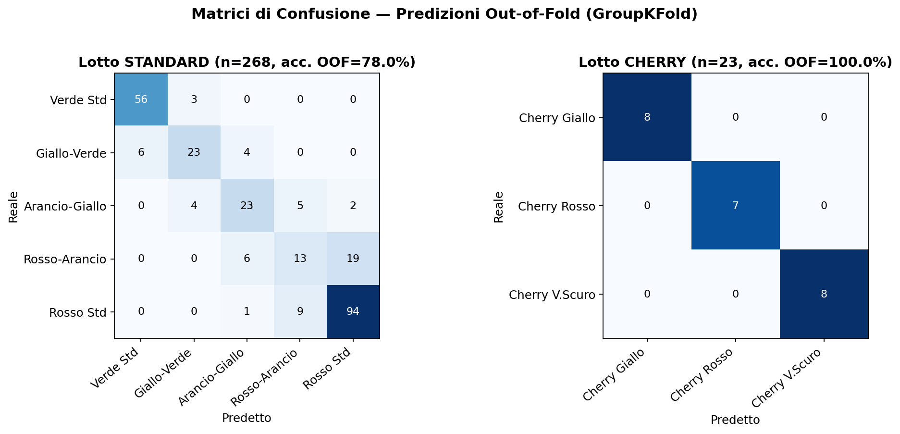
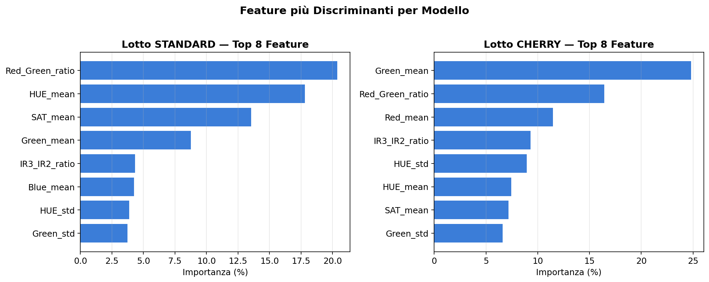

# Real-Time Optical Sorting ML Pipeline
**Automated Tomato Grading & Classification System for High-Speed Conveyor Lines**


---

## Executive Summary

Questo repository implementa una pipeline di ingegneria dei dati, addestramento di Machine Learning ed esportazione firmware per un sistema di smistamento ottico industriale a spettro multiplo (Line-Scan RGB/NIR/HSI).

Il software elabora in tempo reale i profili spettrali di frutti (pomodori standard e cherry) in transito ad alta frequenza su nastri trasportatori, classificando stadio di maturazione e calibro del prodotto per inviare un comando pneumatico di espulsione.

Il sistema è progettato attorno a un vincolo operativo reale della linea: **ogni lotto lavorato è omogeneo** — o tutto pomodoro standard, o tutto cherry — e il tipo di lotto è **noto a priori**, impostato dall'operatore o dal sistema a monte prima che un solo frutto passi sotto il sensore. Questo vincolo guida l'intera architettura: due modelli di classificazione dedicati, selezionati da un parametro di configurazione esplicito, con un controllo di coerenza fisica a protezione da errori di impostazione.

---

## System Architecture & Workflow

```text
[ Line-Scan Optical Sensor ]
             |
             v
  (Raw CSV / Encoder Steps)
             |
             v
[ 1. Data Processing & O(1) Streaming Math ] ──> src/data_loader.py
             |
             v
   (Structured Feature Table, incl. is_cherry per lotto)
             |
             v
[ 2. Training PER LOTTO (batch_type esplicito)  ] ──> src/train_model.py
             |             |
             v             v
   (Modello STANDARD)  (Modello CHERRY)
       5 classi            3 classi
             |             |
             v             v
[ 3. Embedded C++ Firmware Translation (2 modelli in 1 header) ] ──> src/export_embedded.py
             |
             v
[ include/tomato_classifier.h ]
   - enum TomatoBatchMode { BATCH_STANDARD, BATCH_CHERRY }
   - tomato_check_batch_anomaly(mode, transit_len)
   - predict_tomato_class(mode, input)  ──> Esecuzione su STM32 / PLC / ESP32
```

`TomatoBatchMode` è una configurazione di linea, impostata una volta per turno/lotto da chi integra il firmware — esattamente come si imposterebbe un "programma" su un macchinario industriale — non una feature calcolata dal sensore frutto per frutto.

---

## Repository Structure

```text
TOMATO-GRADING-ML/
│
├── .github/
│   └── workflows/
│       └── tests.yml                       # CI: esegue tests/ ad ogni push/PR
│
├── .gitignore
├── LICENSE
├── requirements.txt
├── requirements-dev.txt                    # Aggiunge pytest, solo per sviluppo/test
├── README.md                               # Questo documento
│
├── data/
│   ├── raw/                                # Dataset CSV grezzi (campagne di acquisizione sul campo)
│   ├── processed/                          # Dataset tabellare pulito (tomatoes_features.csv)
│   ├── schema/                             # Data Dictionary (optical_sensor_data_dictionary.xlsx)
│   └── photos/                             # Riferimenti visivi e campioni per classificazione
│
├── docs/
│   ├── sorting_classes_taxonomy.md         # Tassonomia delle 8 classi e logica di scarto pneumatico
│   └── images/                             # Grafici (confusion matrix, feature importance) usati nel README
│
├── firmware/
│   └── tomato_esp32_test/                  # Sketch di benchmark su ESP32 (latenza reale su hardware)
│       ├── tomato_esp32_test.cpp
│       ├── tomato_core.c
│       └── tomato_classifier.h
│
├── include/
│   └── tomato_classifier.h                 # Firmware C/C++ generato (2 modelli, batch mode esplicito)
│
├── models/
│   ├── model_standard_metadata.json        # Metadati modello (data training, n. campioni) -- il .pkl e' gitignored
│   └── model_cherry_metadata.json
│
├── src/
│   ├── data_loader.py                      # Pulizia, filtrazione hardware e sessionization
│   ├── train_model.py                      # Training per-lotto, validazione GroupKFold, persistenza modello
│   └── export_embedded.py                  # Traduttore modello -> codice embedded C
│
└── tests/
    ├── conftest.py
    ├── test_data_loader.py
    ├── test_train_model.py
    └── test_export_embedded.py             # Include un test che compila l'header C con gcc
```

---

## Data Processing & Streaming Math

I dati grezzi provengono da sensori che scansionano il passaggio dei frutti a fette trasversali lungo l'asse longitudinale. Il modulo `src/data_loader.py` implementa:

1. **Hardware Gatekeeper Filtering** — elimina il rumore del nastro tramite il registro di validità ottica (`validity_flag == 0` -> valido).
2. **Fruit Sessionization** — intercetta il fronte di salita del contatore di scansione (`frame_id == 1`) per raggruppare le letture lineari in un unico vettore di feature per ogni frutto fisico.
3. **Spettrometria in Streaming (O(1))** — calcolo al volo di medie, deviazioni standard e indici chimici combinati (rapporti tra canali).

L'output è `data/processed/tomatoes_features.csv`, con una riga per frutto e una colonna `is_cherry` che identifica il lotto di provenienza — usata per instradare ciascun frutto verso il modello corretto in fase di training (vedi sezione successiva).

---

## Class Taxonomy

| ID | Classe | Tipo Lotto | Esito |
|----|--------|:----------:|-------|
| 0 | Pomodoro Verde Standard | STANDARD | Scarto |
| 1 | Pomodoro Giallo-Verde | STANDARD | Scarto |
| 2 | Pomodoro Arancio-Giallo | STANDARD | Conforme |
| 3 | Pomodoro Rosso-Arancio | STANDARD | Conforme |
| 4 | Pomodoro Rosso Standard | STANDARD | Conforme |
| 5 | Pomodorino Giallo (Cherry) | CHERRY | Conforme |
| 6 | Pomodorino Rosso (Cherry) | CHERRY | Conforme |
| 7 | Pomodorino Verde Scuro Sfumato | CHERRY | Scarto |

Dettagli completi della tassonomia e della regola di identificazione del calibro (basata su `transit_len`) in `docs/sorting_classes_taxonomy.md`.

---

## Architettura a Due Modelli (Batch Mode)

Dato che in campo i lotti sono sempre omogenei e il tipo è noto in anticipo, il sistema non tratta `is_cherry` come una misura da dedurre frutto per frutto: lo tratta come **parametro di configurazione esplicito** scelto a monte, che seleziona quale dei due modelli dedicati usare.

```python
# src/train_model.py
BATCH_CONFIG = {
    "standard": {"is_cherry_value": 0, "classes": [0, 1, 2, 3, 4]},
    "cherry":   {"is_cherry_value": 1, "classes": [5, 6, 7]},
}
```

`train_and_evaluate_model(data_dir, batch_type="standard")` filtra il dataset per tipo di lotto prima di addestrare, e produce un modello dedicato a 5 o 3 classi. Questa separazione ha due vantaggi concreti:

- **Ogni modello risolve un problema più semplice** (5 o 3 classi invece di 8), invece di dover anche re-imparare la distinzione standard/cherry ad ogni predizione.
- **L'interfaccia firmware è esplicita**: chi integra `tomato_classifier.h` dichiara `BATCH_STANDARD` o `BATCH_CHERRY` una sola volta per turno, con lo stesso identico schema di feature ottiche in entrambi i casi (nessun valore "speciale" nascosto tra le misure del sensore).

### Controllo di coerenza (anomaly detection)

Fidarsi ciecamente del parametro di lotto è un rischio: se un frutto anomalo finisce nel cassone sbagliato (es. un cherry tra gli standard), il sistema non se ne accorgerebbe. Per questo la pipeline include un controllo incrociato basato su `transit_len` — una misura fisica reale (lunghezza di transito sul sensore, correlata al calibro del frutto):

```python
# src/train_model.py
def check_batch_consistency(batch_type, transit_len,
                             standard_min_transit_len=12,
                             cherry_max_transit_len=12):
    if batch_type == "standard":
        return transit_len > standard_min_transit_len
    elif batch_type == "cherry":
        return transit_len <= cherry_max_transit_len
```

Le stesse soglie (12 / 12 step encoder, dati verificati in `docs/sorting_classes_taxonomy.md`) sono replicate nel firmware C tramite `tomato_check_batch_anomaly()` (vedi sezione Embedded Firmware). La soglia è unificata a 12 perché nessun cherry nel dataset supera quel valore: usare lo stesso limite anche lato standard cattura il 100% dei cherry, riducendo i falsi positivi sui pomodori standard dal 23.5% al 14.6% rispetto a una soglia scelta senza verifica sui dati.

> **Nota:** un residuo 14.6% di falsi positivi sui pomodori standard resta, perché esiste una sovrapposizione fisica reale tra i pomodori standard più piccoli/corti e i cherry più grandi — non eliminabile con una soglia singola su `transit_len`. Combinare `transit_len` con `valid_slices` è stato testato e scartato: riduce i falsi positivi ma fa perdere il riconoscimento di molti cherry veri.

---

## Machine Learning & Validation Protocol

### Model Selection & Hardware Constraints

Il motore di inferenza è un `RandomForestClassifier` (`n_estimators=35`, `max_depth=6`) per ciascun lotto, scelto per la sua traducibilità diretta in codice C nativo senza dipendenze — un requisito chiave per l'esecuzione su microcontrollori a risorse limitate. La profondità massima di 6 limita i salti condizionali **per singolo albero**; il costo computazionale reale di un'inferenza è la somma su tutti e 35 gli alberi della foresta, non 6 salti totali — vedi la nota sulla latenza più sotto.

### Cross-Validation Protocol

La validazione usa `GroupKFold` a 5 split, raggruppata per `tomato_id`. Dato che ogni frutto fisico viene scansionato una sola volta, `tomato_id` è univoco per riga: questa GroupKFold è nella pratica equivalente a una KFold standard.

Questa è una scelta consapevole, non un limite da correggere: non c'è rischio di leakage classico (nessun frutto fisico compare due volte nel dataset), e raggruppare per giornata di campagna — l'alternativa più rigorosa in teoria — **non è applicabile a questo dataset**: 6 classi su 8 esistono in una sola delle due giornate di raccolta (le tre classi cherry esistono solo nel giorno 2, tre classi standard intermedie solo nel giorno 1). Tenere fuori una giornata intera per validare azzererebbe il training set proprio di quelle classi.

Il limite reale non è la formula di cross-validation, è che il modello non è mai stato validato su condizioni di raccolta diverse (luce, calibrazione, lotto) per la maggior parte delle classi — servono più campagne di raccolta sul campo, non un altro split.

### Operational Performance (Out-of-Fold, dati reali)

| Lotto | Campioni | Classi | Accuratezza media (CV) |
|---|---|---|---|
| **STANDARD** | 268 | 5 | 77.98% (± 4.03%) |
| **CHERRY** | 23 | 3 | 100.00% (± 0.00%) |

> ⚠️ **Il numero del lotto CHERRY va interpretato con cautela.** Con sole 23 osservazioni totali (7-8 per classe), il 100% è compatibile sia con un modello davvero molto efficace su un problema semplice, sia con un campione troppo piccolo per stimare l'accuratezza in modo affidabile. Prima di validarlo per la produzione servono più dati di campagna per il lotto cherry.

Esegui `python3 src/train_model.py` per rigenerare questi numeri sul dataset corrente — lo script stampa anche la matrice di confusione e la classifica delle feature più discriminanti per ciascun lotto.



La fonte di errore più grande nel modello standard è tra **Rosso-Arancio e Rosso Standard** (19 scambi su 38 casi reali di Rosso-Arancio): il modello sbaglia soprattutto tra stadi di maturazione *adiacenti*, non a caso — coerente col fatto che la maturazione è uno spettro continuo, non categorie nettamente separate.



---

## Embedded Firmware Export (C/C++)

`src/export_embedded.py` addestra entrambi i modelli e genera un unico header, `include/tomato_classifier.h`, contenente:

- **Due funzioni di scoring** namespaced (`score_standard`, `score_cherry`) — codice C nativo generato da [m2cgen](https://github.com/BayesWitnesses/m2cgen), zero dipendenze esterne.
- **Un `enum TomatoBatchMode`** (`BATCH_STANDARD`, `BATCH_CHERRY`) — il parametro di configurazione lotto.
- **`tomato_check_batch_anomaly(mode, transit_len)`** — il controllo di coerenza descritto sopra.
- **`predict_tomato_class(mode, input)`** — funzione helper che dispaccia al modello corretto e restituisce sempre l'ID di classe **globale** (0-7), indipendentemente dall'ordinamento interno delle classi scelto da m2cgen.

### Esempio d'uso firmware

```c
TomatoBatchMode current_batch = BATCH_STANDARD;  // impostato UNA VOLTA per turno

// per ogni frutto in transito:
double input[18] = { /* transit_len, valid_slices, IR1_mean, ... */ };

if (tomato_check_batch_anomaly(current_batch, input[0])) {
    // frutto fisicamente incompatibile col lotto dichiarato -> segnala/gestisci a parte
} else {
    int classe = predict_tomato_class(current_batch, input);
    // -> comando pneumatico in base a `classe`
}
```

### ⚠️ Compatibilità C vs C++ — leggere prima di integrare

Le funzioni `score_standard()` / `score_cherry()`, generate automaticamente da m2cgen, usano una sintassi **C99** (compound literal, es. `(double[]){...}` dentro `memcpy`). Questa sintassi è **C valido ma non C++ standard**: un compilatore C++ conforme la rifiuta con un errore del tipo `taking address of temporary array`, anche se il codice è racchiuso in un blocco `extern "C"` (che governa solo il *name mangling*, non la grammatica del linguaggio che il compilatore deve accettare).

**Come integrarlo correttamente:**

| Scenario | Azione |
|---|---|
| Progetto interamente in **C** | Nessuna azione necessaria: il file compila così com'è. |
| Progetto in **C++** (es. STM32CubeIDE con HAL misto C/C++, o Arduino/ESP32) | Isolare `tomato_classifier.h` in una **unità di compilazione `.c` separata**, compilarla con il compilatore C, e collegarla al resto del progetto C++ tramite dichiarazioni `extern "C"`. Solo `predict_tomato_class()` e `tomato_check_batch_anomaly()` sono pensate per l'uso diretto in codice C++. |

Un esempio funzionante di questo schema, verificato end-to-end su hardware ESP32 reale, è in `firmware/tomato_esp32_test/`:

```text
firmware/tomato_esp32_test/
├── tomato_esp32_test.cpp   # Sketch C++ (non .ino — vedi nota sotto) — solo dichiarazioni extern "C"
├── tomato_core.c           # Unità di compilazione C pura — #include "tomato_classifier.h"
└── tomato_classifier.h     # Firmware generato
```

> **Perché `.cpp` e non `.ino`:** il preprocessore "sketch" di Arduino/PlatformIO genera automaticamente i prototipi delle funzioni e li inserisce in cima al file, *prima* che i tipi custom (come `struct TestCase`) siano stati definiti — con parametri passati per riferimento a una struct, questo produce errori di compilazione (`'TestCase' was not declared in this scope`). Usare `.cpp` disattiva questo preprocessore e il file compila nell'ordine in cui è scritto, senza sorprese.

**Demo hardware completa:** oltre al benchmark di latenza, lo sketch pilota due LED (rosso = scarto, verde = conforme) e un piccolo OLED I2C 128x64 che anima il passaggio del pomodoro sul nastro fino al "sensore", dove scatta l'inferenza vera. Include un interruttore a tempo di compilazione (`FAST_VERIFY_MODE`) per passare da una modalità rapida di verifica (via seriale, per il debug) a una più lenta e leggibile pensata per essere filmata.

**Prova la demo dal browser, senza hardware:** [wokwi.com/projects/471166580602582017](https://wokwi.com/projects/471166580602582017) — simulazione interattiva completa (ESP32 + OLED + LED), stesso codice del firmware reale. Utile per esplorare il progetto senza possedere una scheda, ma i tempi di latenza mostrati in simulazione **non sono rappresentativi** di quelli reali (vedi sotto) — per quello, fare riferimento solo ai numeri misurati sull'hardware fisico.

### ⚠️ Stack size su FreeRTOS/ESP32

Le funzioni generate da m2cgen usano centinaia di array temporanei allocati sullo stack (uno per ogni compound literal C99, ~1145 nell'header attuale). Il task di default che esegue `setup()`/`loop()` su Arduino-ESP32 (`loopTask`) ha solo **8KB** di stack — insufficiente, va in stack overflow alla prima chiamata a `score_standard()`. `tomato_esp32_test.cpp` mostra la soluzione: eseguire l'inferenza in un task FreeRTOS dedicato con uno stack esplicito più ampio (`xTaskCreatePinnedToCore(..., 32768, ...)`), invece di fare affidamento sullo stack di default.

### Latenza — misurata, non dichiarata

Il vincolo `max_depth=6` garantisce al massimo 6 confronti condizionali **per singolo albero**; con `n_estimators=35`, una singola inferenza valuta fino a 35 alberi e ne somma i voti. Piuttosto che dedurre la latenza dalla sola profondità dell'albero, `firmware/tomato_esp32_test/` esegue un benchmark reale su hardware ESP32: 16 frutti reali (2 per ciascuna delle 8 classi), predizioni verificate contro l'output del modello Python, latenza media misurata su 2000 ripetizioni per campione.

**Risultati reali (ESP32, misurati con `esp_timer_get_time()`):**

| Modello | Latenza media | Note |
|---|---|---|
| STANDARD (5 classi) | ~220-550 µs | Alberi sempre a profondità massima (6) — 28.6 foglie medie |
| CHERRY (3 classi) | ~43-49 µs | Alberi molto più corti (profondità media 2.77) — dataset di training troppo piccolo (23 campioni) perché l'algoritmo trovi altro da tagliare oltre 2-3 livelli |

Anche il caso peggiore misurato (~550 µs) è ampiamente entro i margini per un sistema in tempo reale su nastro trasportatore — l'inferenza da sola userebbe una frazione minima di qualunque budget di ciclo realistico per questa applicazione.

---

## Testing

```bash
pip install -r requirements-dev.txt
python3 -m pytest tests/ -v
```

19 test, eseguiti automaticamente ad ogni push/PR (vedi badge in cima). Non sono test generici: diversi codificano esplicitamente i bug reali trovati durante lo sviluppo di questo progetto, così che se vengono reintrodotti per errore il test fallisce subito invece di scoprirlo su hardware:

- `is_cherry` non può mai ricomparire tra le feature di training (il bug di data leakage originale)
- la soglia di coerenza (12 step encoder) deve catturare il 100% dei cherry reali del dataset
- il confine esatto della soglia (`transit_len == 12`) deve finire dal lato giusto — è il bordo che nella prima versione avrebbe dimezzato il rilevamento dei cherry
- l'header C generato deve **compilare davvero** con `gcc`, non solo "sembrare" corretto

## Known Limitations

Elenco onesto dei limiti noti di questa versione, utile per pianificare i prossimi passi:

- **Dataset piccolo**: 291 frutti totali raccolti in 2 sole giornate di campagna; il lotto cherry ha solo 23 campioni (7-8 per classe).
- **Copertura multi-giornata incompleta**: i dati coprono solo 2 giornate di raccolta, e 6 classi su 8 esistono in una sola delle due — quindi il modello non è mai stato validato su condizioni diverse (luce, calibrazione, lotto, stagionalità) per la maggior parte delle classi. Non risolvibile riorganizzando la cross-validation, serve più campagne sul campo (vedi sezione ML sopra).
- **Falsi positivi residui nel controllo di coerenza**: la soglia unificata a 12 step encoder cattura il 100% dei cherry ma genera ancora un 14.6% di falsi positivi sui pomodori standard, per sovrapposizione fisica reale nei dati — non risolvibile con `transit_len` da solo (vedi `docs/sorting_classes_taxonomy.md`).
- **Benchmark ESP32 in modalità "replay"**: la latenza misurata riguarda la sola inferenza di classificazione, non l'intera pipeline di acquisizione (il sensore ottico fisico non è ancora collegato).

---

## Quick Start & Execution Pipeline

### 1. Environment Preparation

```bash
python3 -m venv venv
source venv/bin/activate

pip install --upgrade pip
pip install -r requirements.txt
```

### 2. Pipeline Execution

```bash
# 1. Caricamento, pulizia grezzi e calcolo feature O(1) -> data/processed/
python3 src/data_loader.py

# 2. Addestramento e validazione Out-of-Fold PER ENTRAMBI I LOTTI (standard + cherry)
python3 src/train_model.py

# 3. Conversione di entrambi i modelli in un unico header C/C++ -> include/tomato_classifier.h
python3 src/export_embedded.py
```

Per addestrare/valutare un solo lotto in uno script Python personalizzato:

```python
from src.train_model import train_and_evaluate_model

model, feature_cols, df = train_and_evaluate_model("data/raw", batch_type="standard")
# oppure batch_type="cherry"
```

### 3. Benchmark su Hardware Reale (ESP32)

```bash
# Progetto PlatformIO: metti i 3 file di firmware/tomato_esp32_test/ in src/ e include/
# lib_deps richiesti in platformio.ini:
#   adafruit/Adafruit SSD1306@^2.5.7
#   adafruit/Adafruit GFX Library@^1.11.5
pio run --target upload
pio device monitor   # 115200 baud

# In alternativa, prova la demo dal browser senza hardware:
# https://wokwi.com/projects/471166580602582017
```

---

*Industrial AI Architecture — Engineered for High-Speed Conveyor Automation.*
